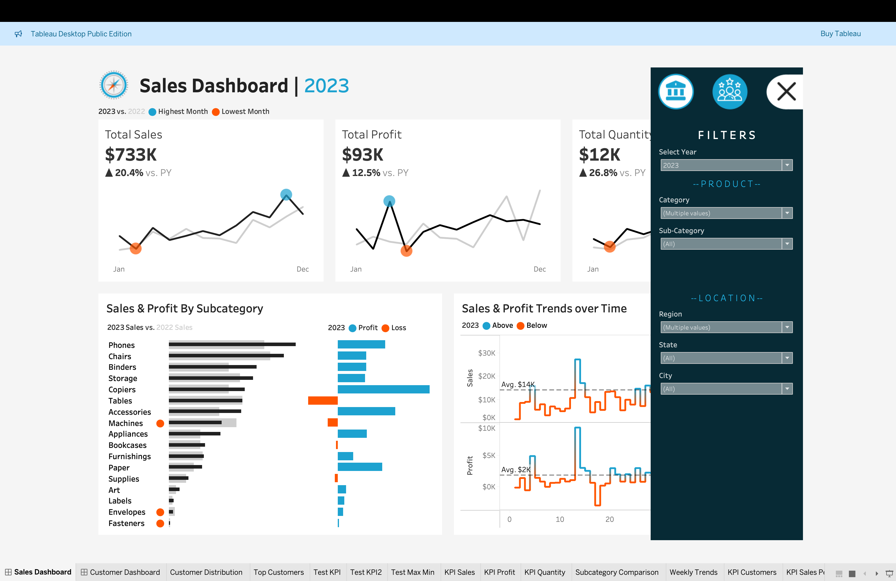

# Sales and Customer Dashboard using Tableau Desktop.

Overview

The Sales and Customer Dashboard is an interactive Tableau workbook that provides an in-depth analysis of sales performance and customer behaviour. This project visualises key metrics and trends to facilitate data-driven decision-making for business stakeholders. The dashboard features a clean and dynamic interface, making it easy to explore and interpret data at various granularities.

## Installation

Use the [Tableau Website](https://www.tableau.com) to install Tableau Desktop or you can try Tableau Cloud Free of Cost.

## Key Features
## Sales Dashboard

Total Sales and Profit Overview:
Displays total sales, profit, and quantity sold for the year, with year-over-year comparisons.
Highlights the highest and lowest performing months using distinct markers for quick visual recognition.

Sales and Profit by Subcategory:
Bar charts present a breakdown of sales and profit across different product subcategories, enabling users to identify top-performing and underperforming categories.

Trends Over Time:
Line charts illustrate sales and profit trends over time, providing insights into seasonal variations and growth patterns.

Dynamic Filtering:
Allows users to filter data by year, category, sub-category, region, state, and city to drill down into specific sales segments.

## Customer Dashboard

Customer Metrics:
Provides key customer metrics, such as total number of customers, sales per customer, and total orders.
Year-over-year performance indicators show growth or decline in customer engagement.

Customer Distribution and Top Customers:
Visual representation of customer distribution based on the number of orders, offering insights into customer purchasing patterns.
Lists top 10 customers by profit, detailing their last order date, total profit contribution, and sales, allowing for targeted marketing and sales strategies.

Order Trends and Analysis:
Line charts display order trends over time, highlighting peaks and dips to help identify patterns in customer ordering behaviour.

## Technical Specifications

Tools Used: Tableau Desktop Public Edition
Data Source: Sales and customer data from [Specify Source]
Visual Elements:
Line and bar charts for trend and distribution analysis
KPIs and performance metrics for quick overview
Heat maps and scatter plots for advanced data correlations

## How to Use

Opening the Dashboard:
Open the Sales_Customer_Dashboard.twbx file in Tableau Desktop.

Exploring the Data:
Use the provided filters to adjust views and focus on specific data points, such as different years or categories.

Interpreting the Visuals:
Hover over visual elements for detailed tooltips and additional insights.

## Conclusion

The Sales and Customer Dashboard is a comprehensive tool that transforms complex sales and customer data into actionable insights. With its interactive visualisations and intuitive interface, this dashboard is designed to support sales and marketing teams in identifying trends, understanding customer behaviours, and making informed business decisions.

## License

[MIT](https://choosealicense.com/licenses/mit/)
